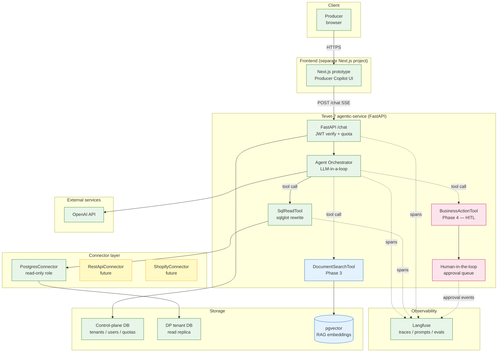
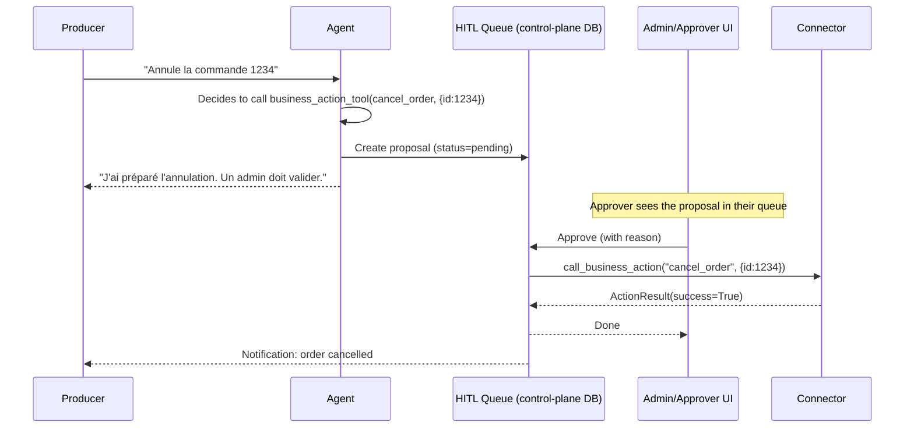

# Tevet-7 — Architecture

> Reference architecture for the Tevet-7 agentic service. This document
> is the canonical source the team should read to understand the system
> before touching code.

---

## 1. Overview

Tevet-7 is a **configurable, multi-tenant platform for enterprise AI
agents**. Each tenant is an enterprise customer; each tenant can deploy one
or more **agents** (e.g. Producer Copilot, Customer Copilot, Admin
Copilot) that reason over the tenant's data through a controlled
abstraction called a **Connector**.

The non-negotiable design principle: **agents can read tenant data, but
only through tools that enforce per-tenant row-level security, validated
SQL, and read-only database roles.** The LLM is never trusted for
security — `sqlglot` rewrites its output before it touches the DB.

First tenant: **Drive Producteur (DP)** — a French click & collect
marketplace. First agent: **Producer Copilot**.

---

## 2. System diagram

**Legend:** green = Phase 0 (skeleton), yellow = Phase 1, blue = Phase 3
(RAG), pink = Phase 4 (HITL).

---

## 3. Multi-tenant model

Tevet-7 is **multi-tenant by design**, not retrofitted. Three layers of
isolation:

1. **Logical tenant identifier** (`tenant_id` like `dp`) carried in every
   JWT and every internal call.
2. **Per-tenant credentials & connectors.** Each tenant's data lives in its
   own database (or REST API), accessed via a Connector configured with
   credentials stored **encrypted** in the control-plane DB. Agents never
   see the credentials.
3. **Per-tenant schema file** (`schema.yaml`). Defines the tables, columns,
   role allowlists, scope columns, and forbidden tables. The SqlReadTool
   loads the right schema per request.

The control-plane DB (one Postgres instance) holds:

- `tenants` — tenant registry + encrypted connector config.
- `users` — users per tenant, with role assignments.
- `quotas` — daily token consumption per tenant.
- `audit_logs` — every security-relevant event (rewrites, refusals,
  approvals). Immutable.
- `conversations` (Phase 2) — multi-turn memory.
- `documents` (Phase 3) — pointers to RAG-indexed files.

Tenant business data (e.g. Drive Producteur's `orders`, `products`, ...)
lives in the tenant's own DB and is **never** replicated into the control
plane.

---

## 4. Security model

This is the heart of the pitch. Four layers of defense in depth:

### 4.1 Row-level scoping by `producer_id`

Every producer-scoped table in `schema.yaml` carries a
`tenant_scope_column` (always `producer_id` for DP). The user's
`scope_value` (e.g. `42`) comes from the verified JWT.

### 4.2 `sqlglot` AST rewriting

The LLM generates SQL, but `SqlReadTool.validate_and_rewrite` parses it with
`sqlglot` and rewrites the AST to guarantee:

| Check                                          | Action on violation                       |
|------------------------------------------------|-------------------------------------------|
| Statement is not `SELECT`                      | Reject (security incident if intentional) |
| References a forbidden table                   | Reject                                    |
| References a table not in role's allowlist     | Reject                                    |
| Missing `WHERE producer_id = X` at any level   | Inject the correct predicate              |
| Wrong `producer_id` value (LLM tried to bypass)| Rewrite to correct value + log SECURITY WARNING |
| No `LIMIT`                                     | Append `LIMIT 1000`                       |
| Dangerous functions (`pg_sleep`, `lo_import`)  | Reject                                    |

Because the rewrite is AST-based, it cannot be defeated by SQL comments,
string concatenation, or unusual formatting.

### 4.3 Read-only Postgres role

The `PostgresConnector` connects with a Postgres role that has `SELECT`
grants only — no `INSERT`/`UPDATE`/`DELETE`/DDL. Even a hypothetical bug in
the rewriter cannot lead to a write.

### 4.4 JWT verification

Every `/chat` request carries a Bearer JWT signed with `JWT_SECRET`. The
handler extracts `tenant_id`, `user_id`, `role`, `scope_value` from the
JWT. The body's role/scope are **ignored** in production — they are a dev
convenience only and a mismatch raises `HTTP 401`.

The full security test suite is in `tests/test_sql_security.py` — it is the
artifact we show enterprise customers and auditors.

---

## 5. Tool registry concept

Tools are registered per-agent in a small in-process registry. Each tool:

- Has a stable name (e.g. `sql_read_tool`) and a JSON-schema description of
  its input — that's what the LLM sees as the function signature.
- Is constructed **per request** with the caller's verified identity, so it
  cannot leak data across tenants even if the orchestrator bugs out.
- Wraps a Connector and adds tool-specific logic (e.g. SQL rewriting).
- Emits a Langfuse span per call.

Planned tools:

| Tool                  | Phase | Purpose                                              |
|-----------------------|-------|------------------------------------------------------|
| `sql_read_tool`       | 1     | Read-only SQL on tenant data (with RLS rewriting).   |
| `document_search_tool`| 3     | pgvector RAG over tenant-uploaded docs.              |
| `business_action_tool`| 4     | Propose a write; queue for human approval.           |
| `visualization_tool`  | 2     | Turn a `QueryResult` into a chart spec.              |
| `webhook_emit_tool`   | 5     | Fire outbound webhooks on agent-defined triggers.    |

---

## 6. Human-in-the-loop queue (Phase 4)

Some actions are too risky to let an LLM fire directly: refunding a payment,
cancelling an order, modifying stock. These go through the
`business_action_tool`, which **never executes** — it **proposes**.

Every step is audited and Langfuse-traced. The proposal lifecycle
(`pending → approved | rejected → applied | failed`) lives in the
control-plane DB.

---

## 7. Phase roadmap

| Phase | Goal                                                       | Deliverable |
|-------|------------------------------------------------------------|-------------|
| **0** | Skeleton + reference architecture (this PR).               | Files only; `/chat` returns 501. |
| **1** | Real `/chat` + `SqlReadTool` end-to-end on DP.            | Producer can ask questions about their data, SSE streaming, Langfuse trace per request. |
| **2** | Multi-turn memory + visualization tool + rate limiting.   | Conversations persist; charts render in the prototype. |
| **3** | RAG: `document_search_tool` with pgvector.                | Producers can upload invoices/specs and ask about them. |
| **4** | Human-in-the-loop queue for write actions.                | `cancel_order` / `update_stock` go through approval. |
| **5** | Multi-tenant onboarding + Connector SDK.                  | New tenant = one config + one Connector subclass. |
| **6** | LangGraph migration for complex agent graphs.             | Branching, parallel tool calls, sub-graphs. |
| **7** | Eval harness + golden datasets per tenant.                | CI fails on agent regression; Langfuse evals dashboard. |
| **8** | Production hardening: SSO, billing, audit export, SOC2.   | Generally available. |

---

## 8. Open questions (parking lot)

- **Multi-region.** Where does the control plane live vs. tenant read
  replicas? Likely control plane in EU, tenant replicas close to the
  tenant's data residency. Phase 5.
- **Streaming + Langfuse.** Langfuse trace finalisation happens after the
  response is sent — we need a background task to flush. Phase 1.
- **Cost attribution.** Per-user cost attribution on top of per-tenant
  quotas? Probably yes for enterprise tier. Phase 8.
- **Cold start.** Per-request connector construction adds latency. We'll
  add a small per-process cache keyed by `(tenant_id, role, scope_value)`.
  Phase 1.
